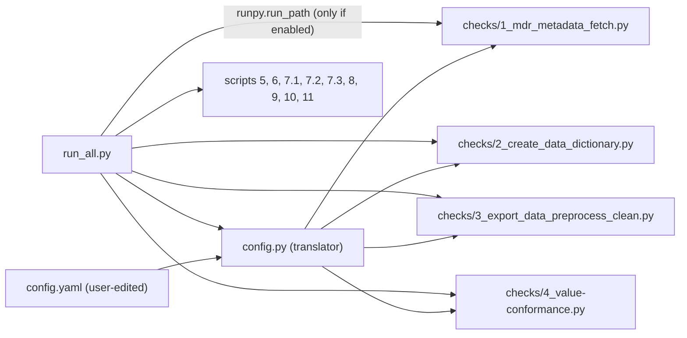

## Overview

Introduce three new project-root files and refactor the four scripts that carry `THIS` markers so they read from the translator instead of hardcoded constants.



## New files

### 1. `config.yaml` (project root)

Contains only what the user needs to touch. Everything else stays derived from `PROJECT_ROOT` inside `config.py`.

```yaml
registry:
  namespace: "osse-11"     # THIS - MDR namespace
  name: "ACLF"             # THIS - short registry name (used in output filenames)
  url_prefix: "test.aclf"  # THIS - subdomain of *.register.imi-frankfurt.de

paths:
  raw_export: "data/raw/ACLF_2026-02-12_MDAT.csv"  # THIS - relative to project root

scripts:
  "1_mdr_metadata_fetch": true
  "2_create_data_dictionary": true
  "3_export_data_preprocess_clean": true
  "4_value-conformance": true
  "5_daterules": true
  "6_ranges": true
  "7.1_Form_versioning_JSON_to_CSV": true
  "7.2_expected_elements_per_patient_with_versions": true
  "7.3_completeness_checks": true
  "8_calculations": true
  "9_import_checks": true
  "10_longitudinal_plausibility": true
  "11_relational_conformance": true
```

### 2. `config.py` (project root) — the translator

Single source of truth. Loads `config.yaml` once at import time and exposes:

- `PROJECT_ROOT: Path` — resolved from `__file__`
- `NAMESPACE: str`, `REGISTRY_NAME: str`, `URL_PREFIX: str`
- `RAW_EXPORT_PATH: Path` — resolved against `PROJECT_ROOT` if the yaml value is relative
- `SCRIPTS: dict[str, bool]` — script-id -> enabled flag
- `is_enabled(script_id: str) -> bool`
- `CONFIG_PATH: Path` — where the yaml was loaded from (allows override via env var `SARA_CONFIG`)

Uses `PyYAML` (`pip install pyyaml`) with a clear error if missing. Validates required keys and raises a helpful `ConfigError` naming the missing field.

### 3. `run_all.py` (project root) — the runner

- Imports `config`.
- Defines the canonical script order (matching the numbered filenames).
- For each script id in order: if `config.is_enabled(id)` -> print a banner and `runpy.run_path(str(checks_dir / f"{id}.py"), run_name="__main__")`; else print `SKIPPED (disabled in config.yaml)`.
- On any script's exception: print full traceback and stop (fail-fast; the pipeline is sequential).
- Accepts optional CLI args: `--only 4_value-conformance 5_daterules` (override, run just these) and `--config path/to/other.yaml`.

## Script edits (only the 4 files with `THIS` markers)

Each keeps its own `PROJECT_ROOT` derivation for standalone execution but pulls the marked values from the translator.

- [checks/1_mdr_metadata_fetch.py](checks/1_mdr_metadata_fetch.py) lines 11-12: replace
  ```python
  NAMESPACE = "osse-11"
  REGISTRY_NAME = "ACLF"
  ```
  with
  ```python
  from config import NAMESPACE, REGISTRY_NAME
  ```
  (add project root to `sys.path` at top so the standalone `python checks/1_...py` still works).

- [checks/2_create_data_dictionary.py](checks/2_create_data_dictionary.py) lines 14-16: same pattern, importing `NAMESPACE`, `REGISTRY_NAME`, `URL_PREFIX`.

- [checks/3_export_data_preprocess_clean.py](checks/3_export_data_preprocess_clean.py) line 26: replace hardcoded `DATA_PATH` with `from config import RAW_EXPORT_PATH as DATA_PATH`.

- [checks/4_value-conformance.py](checks/4_value-conformance.py) line 7: replace hardcoded `REGISTRY_NAME` with `from config import REGISTRY_NAME`.

The other 9 scripts are unchanged — they only use derived paths under `PROJECT_ROOT`, which don't need externalizing per the `THIS` markers.

## sys.path shim (top of each edited script)

```python
import sys
from pathlib import Path
sys.path.insert(0, str(Path(__file__).resolve().parent.parent))
from config import ...
```

This lets both `python run_all.py` and `python checks/4_value-conformance.py` work.

## Dependency

Add `pyyaml` requirement. Since the repo has no `requirements.txt` today, create one at project root:

```
pandas
requests
pyyaml
```

## User workflow after the change

1. Edit `config.yaml` (registry values + toggle scripts on/off).
2. Run `python run_all.py` from project root — runs every enabled script in order.
3. Optionally still run any single script directly (`python checks/6_ranges.py`); it will pick up the same config.